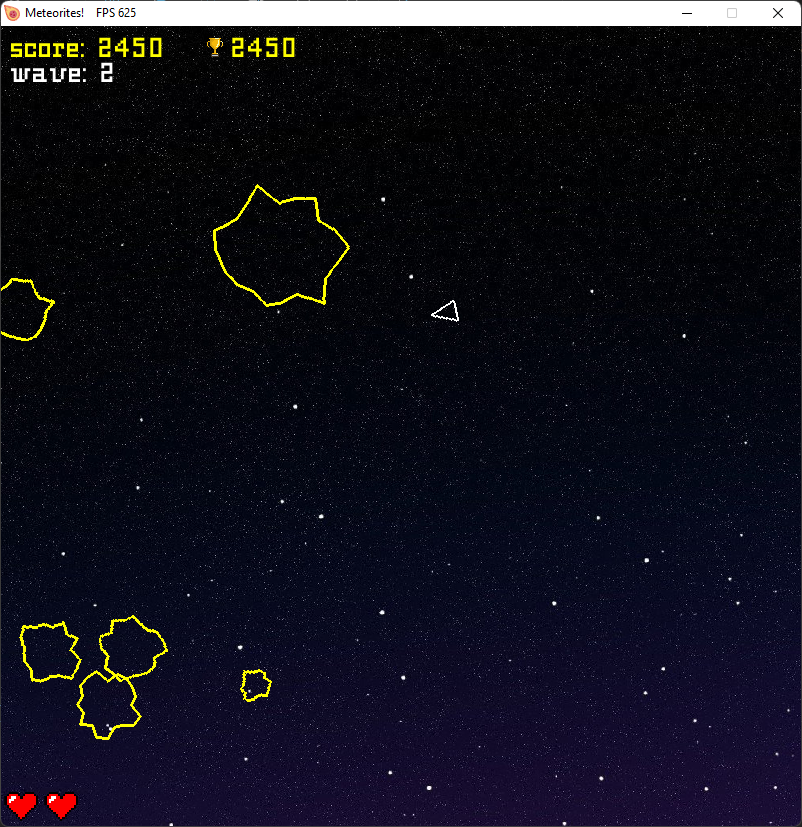

# Meteorites!

Meteorites arcade game made with `Pygame` library in `Python 3`!

---

### How to play

- To play the game, just open the `meteorites.exe` application. You don't need to install anything, since the application is a stand-alone program
- Use `arrow buttons` for moving around
- Hit `spacebar` to shoot

### Rules

- Destroy as many meteorites as you can. Meteorites can be destroyed by shooting at them
- Don't get hit by a meteorite, or you will lose one of your spaceships. You have 3 spaceships in total

---

---

### Requirements

- Nothing is required to play the game, but for development purposes you will need:
  * `Python 3` You can download Python from [here](https://www.python.org/downloads/)
  * `Pygame` You can find download instructions for the module from [here](https://github.com/pygame/pygame)
  * `Pathlib` You can find download instructions for the module form [here](https://pypi.org/project/pathlib/)

---

# License
- This repository is licensed with MIT-license. To learn more about the MIT-license, check out [this](https://en.wikipedia.org/wiki/MIT_License) webpage.

---